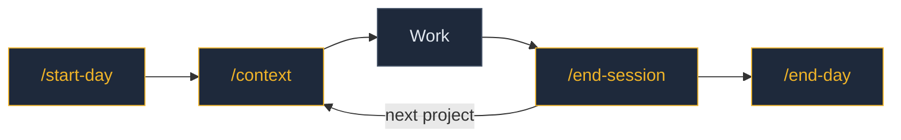
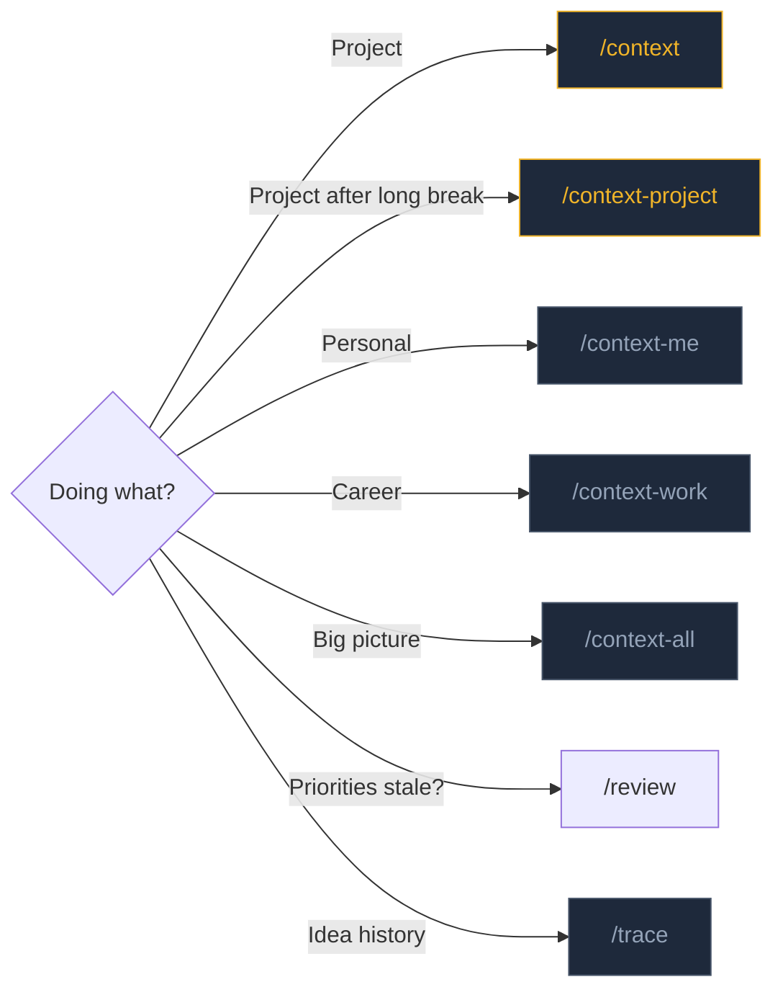

# Command Workflow

How to use the second brain commands throughout a typical day. Use the lightest context that fits the task.

## The Daily Loop

**`/start-day`** — morning orientation. Reads [[Current Focus]], open threads, uncommitted work.
**`/context`** — start of each project session. Auto-detects project, loads dependencies.
**Work** — just work. Claude has your context. Ask for extra vault notes as needed.
**`/end-session`** — captures what happened. Logs commits, decisions, knowledge.
**`/end-day`** — aggregates all projects, writes the daily note, flags uncommitted work.
**`/review`** — whenever priorities feel stale. Compares actual work against [[Current Focus]], proposes updates.

## Pick the Right Command

## Context Weight

Lighter = faster + cheaper. Use the minimum that fits.

| Command | Load | When |
|---------|------|------|
| `/context-me` | ~3 notes | Personal, casual, identity questions |
| `/context-work` | ~5-8 notes | Career, job prep, work planning |
| `/context` | varies | Project work (auto-detects) |
| `/context-project` | heavier | Deep project work after a break |
| `/context-all` | entire vault | Cross-project planning, vault maintenance |

## Other Commands

| Command | When |
|---------|------|
| `/review` | Review and update Current Focus — compare work against priorities |
| `/trace <topic>` | See how an idea evolved across the vault |
| `/update-context-dependencies` | Audit project dependencies (run occasionally) |

## Building the Habit

The minimum daily loop is three commands: `/start-day` → `/context` → `/end-day`. Run `/review` whenever your Current Focus feels stale — there's no fixed cadence. Everything else is optional and compounds over time.
