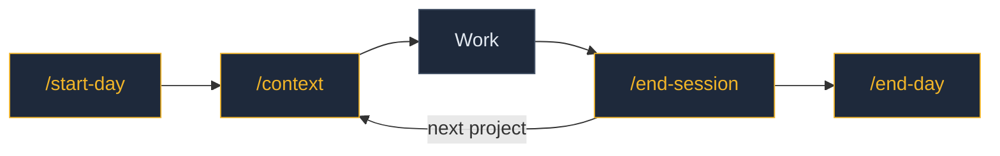

# Command Workflow

How to use the second brain commands throughout a typical day. Use the lightest context that fits the task.

## The Daily Loop



**`/start-day`** — morning orientation. Open threads, uncommitted work, goals, priorities from the vault.
**`/context`** — start of each project session. Auto-detects project, loads dependencies.
**Work** — just work. Claude has your context. Ask for extra vault notes as needed.
**`/end-session`** — captures what happened. Logs commits, decisions, knowledge.
**`/end-day`** — aggregates all projects, writes the daily note, flags uncommitted work.

## Commands Reference

### Daily lifecycle

| Command | What it does |
|---------|-------------|
| `/start-day` | Morning briefing — reads yesterday's open threads, scans for uncommitted work, surfaces priorities, writes Intentions in today's daily note |
| `/end-session` | Wraps up a project work session — logs commits, decisions, insights, and ideas to the project's vault note as a session entry |
| `/end-day` | End-of-day wrap-up — aggregates all project sessions, writes a narrative daily note with structured frontmatter, flags open threads |

`/start-day` and `/end-day` are a pair — one opens the day, the other closes it. `/end-session` runs between them, once per project session.

### Context loading

| Command | Load | When to use |
|---------|------|-------------|
| `/context` | varies | Project work — auto-detects your project from the working directory and loads its dependencies |
| `/context-me` | ~3 notes | Personal questions, casual use — loads only identity (About Me, Preferences, Goals) |
| `/context-work` | ~5-8 notes | Career and job context — identity + work history + current role |
| `/context-project` | heavier | Deep project work after a long break — adds tasks and recent activity on top of `/context` |
| `/context-all` | entire vault | Cross-project planning, vault maintenance, holistic sessions |

Lighter = faster + cheaper. Use the minimum that fits the task.

### Maintenance and exploration

| Command | When to use |
|---------|-------------|
| `/trace <topic>` | See how an idea evolved across the vault over time |
| `/update-context-dependencies` | Audit and update project dependency declarations (run occasionally) |

## How context loading works

Each project note in `Projects/` declares its own dependencies via frontmatter:

```yaml
directory: my-project
context-dependencies:
  - Design/Design System.md
  - Me/Work & Career.md
```

When you run `/context` inside a project folder, it:
1. Matches the working directory to a project note's `directory` property
2. Loads Core Identity (About Me, Preferences, Goals)
3. Reads the project note
4. Reads each note in `context-dependencies`

If no project matches, it falls back to Core Identity + Extended Identity.

See [[Context Manifest]] for the full tier system.

## Daily note format

The daily note has three sections:

- **Intentions** — written by `/start-day`. What the day should be about, based on open threads and priorities.
- **Log** — written by `/end-day`. A narrative summary of what happened — prose, not bullets.
- **Reflections** — written by you. Thoughts, observations, anything on your mind.

Structured data (projects touched, decisions, open threads) lives in the daily note's frontmatter, where Dataview can query it.

## Building the habit

The minimum daily loop is three commands: `/start-day` → `/context` → `/end-day`. Everything else is optional and compounds over time.
